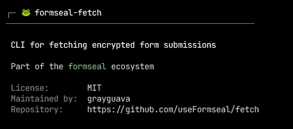

<p align="center">
  
</p>

<p align="center">
  
  
  
  
</p>

<p align="center">
  Download encrypted form submissions from your storage backend.
</p>

---

formseal-fetch pulls ciphertexts stored by your backend down to your machine. Nothing is decrypted in transit or on the server — only the holder of the private key can read submissions.

formseal-fetch is not a hosted service or dashboard. It is a CLI fetch utility.

---

## Installation

**Via pipx (recommended)**

```bash
pipx install formseal-fetch
```

**Via pip**

```bash
pip install formseal-fetch
```

---

## Quick start

```bash
fsf connect provider:<name>
fsf fetch
fsf status
```

---

## How it works

```
Browser (formseal-embed)
       │
       ▼ (encrypted submissions)
 Cloudflare KV / Supabase / any other server
       │
       ▼ (fsf fetch)
  ciphertexts.jsonl ──► Your PC
```

Your backend stores opaque ciphertext only. `fsf fetch` downloads it. Decryption happens separately, offline, with your private key.

---

## Commands

| Command | Description |
|---------|-------------|
| `fsf` | Show about / info |
| `fsf connect` | Connect to a storage provider |
| `fsf fetch` | Download ciphertexts |
| `fsf status` | Show connection info |
| `fsf disconnect` | Clear credentials |
| `fsf disconnect --wipe` | Clear everything including ciphertexts |
| `fsf providers` | List available backends |

Run `fsf --help` for all options.

---

## Security

Your API tokens never leave your machine. formseal-fetch:

- Stores credentials in your OS keychain (Windows Credential Manager / macOS Keychain / Linux Secret Service)
- Makes direct API calls to your storage backend only
- Sends no telemetry, has no analytics
- Skips already-downloaded ciphertexts automatically

---

## Documentation

- [Getting Started](./docs/getting-started.md)
- [Commands Reference](./docs/reference/commands.md)
- [Troubleshooting](./docs/troubleshooting.md)

## For Developers

- [Provider Guide](./docs/providers/README.md) — Add new storage backends
- [CONTRIBUTING.md](./contributing.md) — Full contributing guide
- [SECURITY.md](./.github/SECURITY.md) — Security policy

## For developers/contributors

- [Provider guide](./docs/providers/README.md) — Add new storage backends
- [CONTRIBUTING.md](./contributing.md) — Full contributing guide

---

Please star the repo if you find formseal-fetch useful.

---

## License

MIT